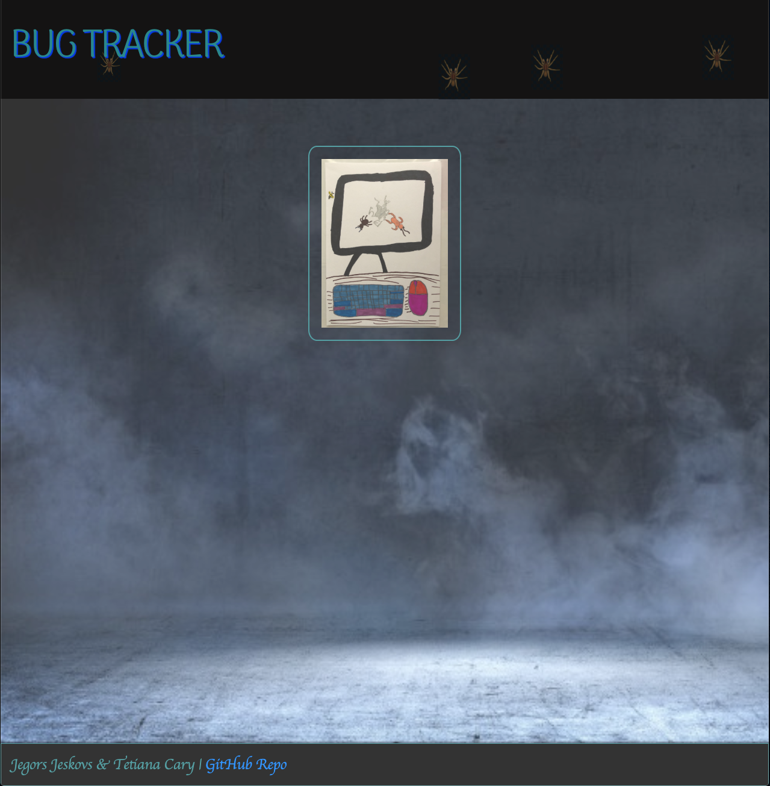
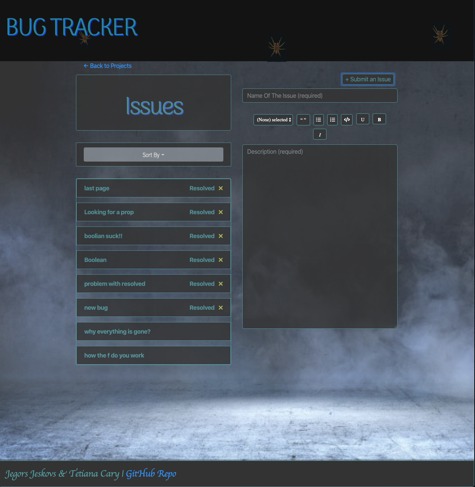
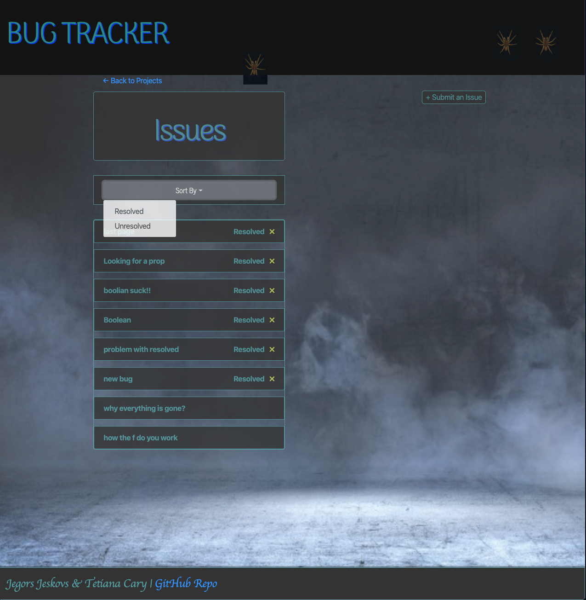

# BugTracker

Welcome to the our project management app "Bug Tracker". With the help of this simple yet robust app, you will be able to stay on top of all your projects and all the tasks associated with those projects. 

When you build an application so many issues and ideas come your way that you need something to keep track of it, use Bug Tracker for all your developments! Easy, secure, accurate!

### The welcome screen is simple, just click the image to start the App.

### The next screen is the list of all your projects. With an option to add the project in the top right corner of the main app. At this point the user also can search for any tasks/issue associated with any projects. The search is also auto populating with issues from the database to help the user.  

### Once the existing or a new project is selected, the user is taken to the next page, where the list of all tasks associated with that specific project. 

### The user can add a new task by clicking **"Submit an Issue"** button. 

### The user also has an option to sort all tasks by resolved or unresolved.   

### Once the task is selected, the user is taken to the detail page, where they can edit the task by adding to the detail of the issue. To exit the page, the user must click if the task/issue is resolved or unresolved. 

### And if something went wrong... 

## Technology Used: 
* React, Axios, DraftJS, Express, MongoDB, NodeJS, Styled-Components, SASS 

## Contributors:
* Jegors Jeskovs | https://github.com/jjeskovs
* Tetiana Cary | https://github.com/tcary
