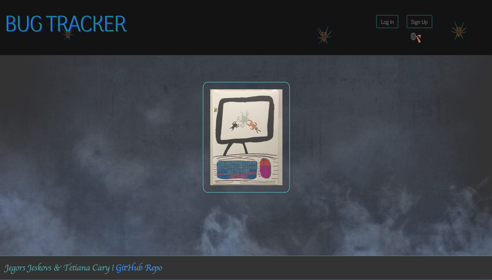
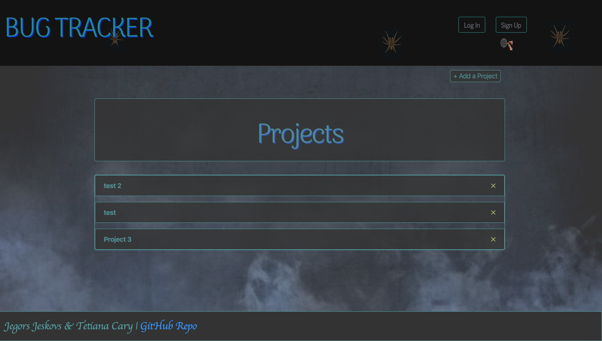
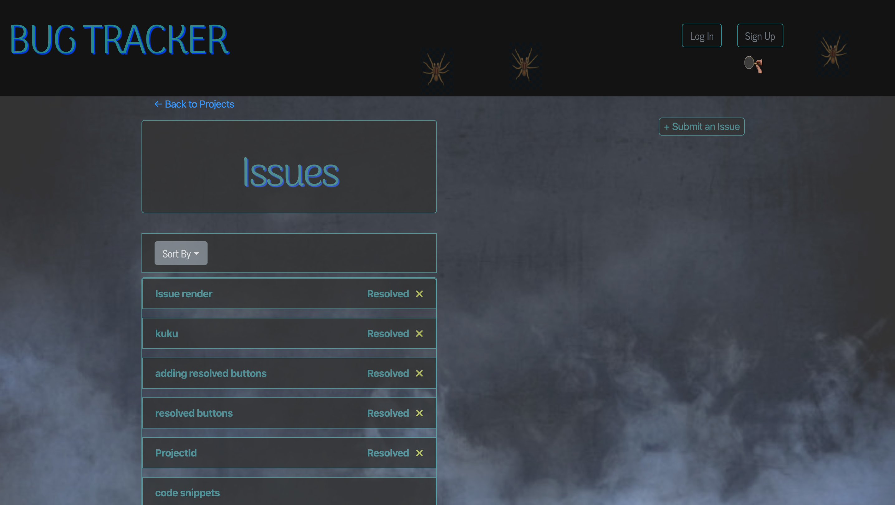
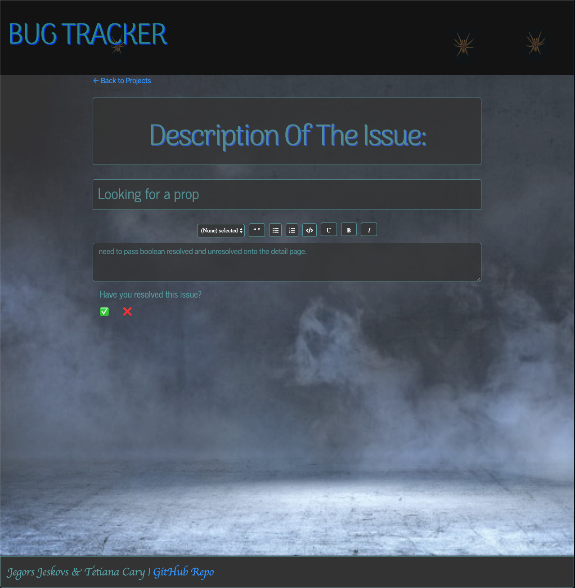
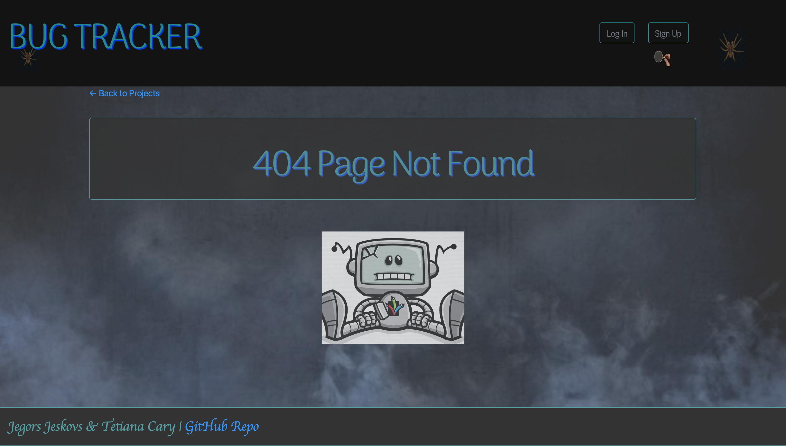

# BugTracker

Welcome to the Bug Tracker App were all your issues kept safe and tracked.
When you build an application so many issues and ideas come your way that you need something to keep track of it, use Bug Tracker for all your developments! Easy, secure, accurate!

## Technology Used: 
* React, Axios, DraftJS, Express, MongoDB, NodeJS, Styled-Components, SASS 

## Contributors:
* Jegors Jeskovs | https://github.com/jjeskovs
* Tetiana Cary | https://github.com/tcary
